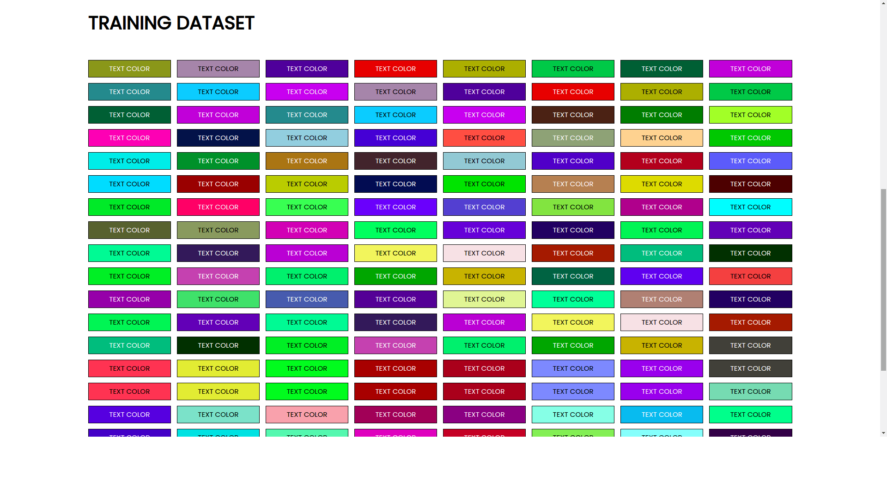
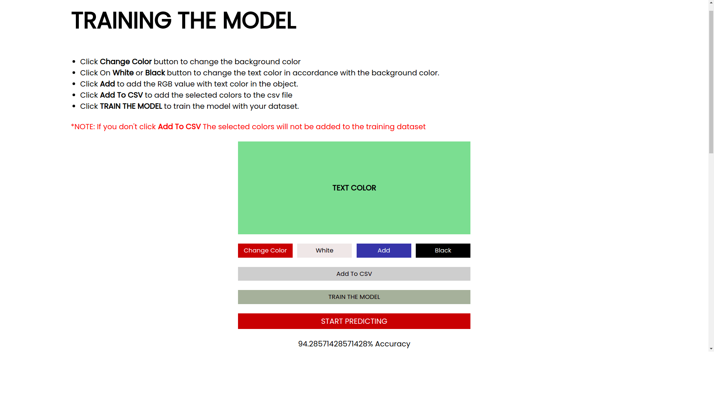
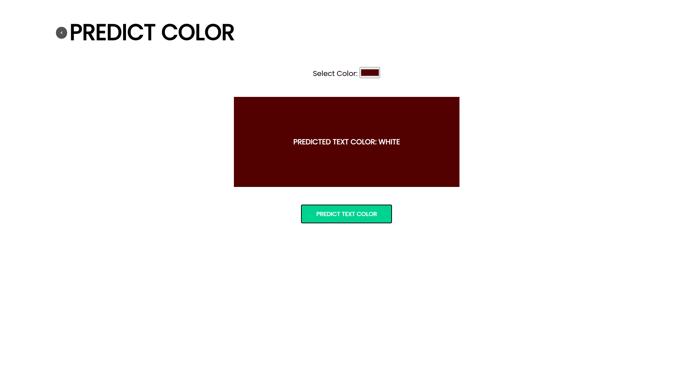

# TEXT COLOR PREDICTOR
> THIS SMALL APPLICATION CLASSIFIES THE TEXT COLOR AS 'BLACK' OR 'WHITE' DEPENDING ON THE BACKGROUND COLOR.

##  Modules, packages and dependencies
---
### Nodejs:
1. Express JS - make the server
2. Python-shell - connects nodejs and python
3. Nodemon for developement

To run:
```console
    npm install
    npm start
```

1. Machine Learning model is already trained.
2. Dataset is already present. 

3. Add values to dataset. And re-train the model.


### PREDICT COLOR

